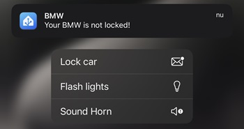

# HA-Configuration
My public HA creations

# My public HA Creations

## Table of contents

- [My public HA Creations](#my-public-ha-creations)
  - [Table of contents](#table-of-contents)
  - [Background](#background)
  - [Charging Pole](#charging-pole)
  - [Charging Reminder](#charging-reminder)
  - [Sonos Notification v6](#sonos-notification)
  - [iPhone Notification v6](#iphone-notification)
  - [Integrate iOS Alarm with Home Assistant](#integrate-ios-alarm-with-home-assistant)

___

## Background

I noticed a screenshot from a colleague showing his HA dashboard in which wrote a nice hack to give him some insights of the status of the nearby public charging poles. So I asked him to share some code with me, which he did. 

This is the result my adoption of his code to my HA instance. You can find the code [here](https://github.com/helmerzNL/HA-Configuration/tree/main/Packages/house/car). Feel free to re-use it.

## Charging Pole
When you download the code, please notice that you need to change the [resource](./Packages/house/car/laadpaal_rest.yaml) parameter. Visit [Nextcharge.app](https://nextcharge.app/) and look for the charging pole you would like to add.

Now, press (F12, to open the Developer Tools) and click the url to open it in a new tab. 

Copy this url and paste it in the *resource* field in the [laadpaal_rest.yaml](./Packages/house/car/laadpaal_rest.yaml) file.

Now restart Home Assistant and create a card showing the created sensors.

## Charging Reminder
Get a reminder when you don't have enough range in your (car) battery left to drive to your next appointment (and back home). To use this automation, there are a few requirements that need to be in place:
* A calendar (I'm using the [Office 365 integration](https://rogerselwyn.github.io/O365-HomeAssistant/) through HACS) integrated in Home Assistant
* The [Waze Travel Time](https://www.home-assistant.io/integrations/waze_travel_time) integration

Besides these two integrations, it makes use of two of my notification scripts:
* [iPhone Notification v6](/Packages/notification/iphone_script_v6.yaml)
* [Sonos Notofication v6](/Packages/notification/sonos_speaker_script_v6.yaml)

*this is work in progress*

## Sonos Notification
I’ve been using Sonos speakers in my house quiet some time. In my early HA days I used Node-red for those notifications. But I found the time to recreate them in native HA automations. [Here](/Packages/notification/sonos_speaker_script_v6.yaml) you can find the latest iteration of the script. 

You can use the script by using my Automation example, which you can find [here](/Packages/_templates/sonos_notification_example_automation.yaml). Customize the defined variables any way you like, they will be passed on (and used) in the script.

**Example**
I've included an example [here](Packages/notification/sonos_service_example.yaml) that will give you an example of a service you could include in your own automations.

*Note: I've included a few conditional actions that are used in combination with a Sonos soundbar and with a LG TV, which will show a toast message if the message has not priority. If you don't have a soundbar you can remove those actions.* 

When u have an Apple TV (or other media player) using the Sonos speaker for audio output, you will also need the [Helper](/Packages/notification/sonos_speaker_helper.yaml). If you don't have this setup (and you don't use one of the Sonos soundbars), you can remove the part in the script that checks (and sets) the input_boolean (marked with *##THIS PART IS ONLY REQUIRED IF YOU HAVE A SONOS SOUNDBAR AND YOU USE IT FOR TV/XBOX/MEDIAPLAYER AUDIO*).

## iPhone Notification
Since we only use iPhones in our house, I have created a [iPhone Notification script](/Packages/notification/iphone_script_v6.yaml) (which probably also works with Android phones btw). You can just call this script from an automation and are then asked to fill out the Fields with options (of which some are required, others are optional). 
One of the more interesting options, in my opinion, is the 'Wanneer Melden?' (Notify When?) field. This field gives you the option to only get an option when your device is in the 'Home' area. If you set this field to 'Away', you will get a notification whether you're at home or away. Comes in handy, when you are not at home and your spouse used the washing machine and receiving the 'washing machine is finished' notification does not make sense when you are not at home.

If you want to edit those fields, just Edit the script (when you've imported it) and update them with your own values (like the phones per person, or the actionable notification options). I've also included the [ios_event automation](/Packages/iOS_notifications_and_actions/ios_action_-_bmw_-_lock_car-blink_lights-sound_horn.yaml) automation, which you can use as an example. You can configure those actions in the iPhone script and after selection them, the iOS_event automation will cick in and perform the tasks configured there.

**Example**
I've had, again, included an example [here](/Packages/notification/iphone_service_example.yaml) that shows an example of a service that you could use in your automation.

## Integrate iOS Alarm with Home Assistant
Would it be nice if you could just configure the alarm on your iPhone and when it is time to go to bed, that time automatically syncs to your HA instance. And then in the morning, when your iPhone alarm goes off, your Sonos speaker starts playing music and your Philips HUE lights slowly turns on (and/or any other device you want to activate when you wake up).

On the official [HA Community forum](https://community.home-assistant.io/t/sync-next-ios16-alarm-clock-in-ha-with-shortcuts-and-companion-app/494726/62) I've found a way (with the help of some Apple Shortcuts) to achieve this. 

The configuration consists of two Shortcuts :

- [Configure HA Alarm](https://www.icloud.com/shortcuts/ee37cd7e90904b38a467a723279665a9) - Configures the Boolean in HA when 'Sleep mode' is turned on. 
- [Turn HA Alarm Off](https://www.icloud.com/shortcuts/ca72d93ecfc7405cab005059c6f0c97c) - Turns Off the Sonos/HUE when you turn off the iOS Alarm (when it sounds)

And a few automations and helpers, which you can find [here](/Packages/house/rooms/bedroom)

Please make sure you edit the Shortcuts to fit your needs:
- entity_id -> use your own input_boolean here, in the shortcut above it is set to input_datetime.ios_alarm (and in my scripts I use input_boolean.wekker_iphone)
- Label -> Edit the label where the Shortcut is looking for, in my example I use *Wekker*

Please let me know if you have any questions.