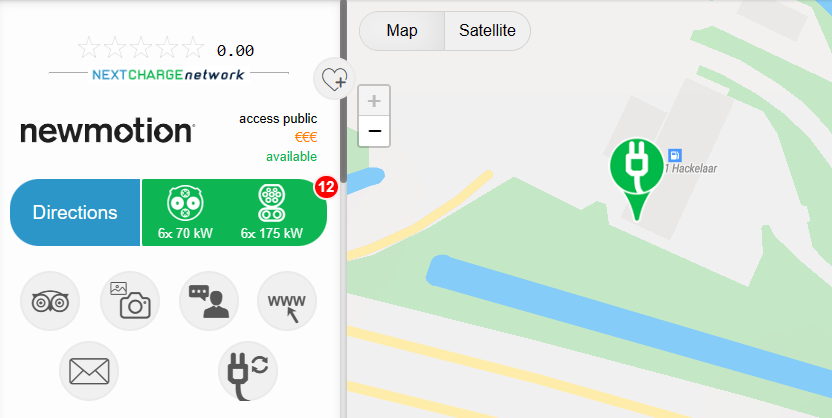
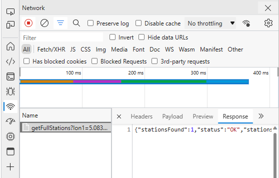
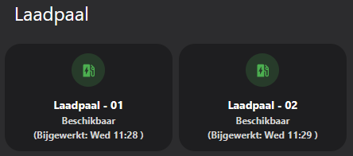

# My HA Creations

On this Git you'll find the __Automations__, __Scripts__, __Dashboards__ and other Home Assistant related stuff I created over the years. If you have any questions (or if something doesn't work anymore), feel free to reach out to me.

- My HA Creations
  - [Background](#background)
  - [Dashboards](#dashboards)
  - [AI Automations](#ai-automations)
  - [Charging Pole](#charging-pole)
  - [Charge Reminder](#charge-reminder)
  - [Notification Scripts](#notification-scripts)
  - [Thanks](#thanks-and-contact)  
  - [Buy Me A Coffee](#buy-me-a-coffee)

___

## Background

I noticed a screenshot from a colleague showing his HA dashboard in which wrote a nice hack to give him some insights of the status of the nearby public charging poles. So I asked him to share some code with me, which he did. 

This is the result my adoption of his code to my HA instance. You can find the code [here](https://github.com/helmerzNL/HA-Configuration/tree/main/). Feel free to re-use it.

## Dashboards

I've been working (or customizing existing) dashboards from which I shared images. Since it's still difficult to re-create a dashboard yourself from just a few images, I'll share the code of those dashboards with you [here](/dashboards/).

## AI Automations
Before you can use these automations, you will need to install the [Open AI Converstation](https://www.home-assistant.io/integrations/openai_conversation) integration. Follow the instructions and create an API, when this is done you are ready to start using the automations.

You can find all my AI Automations [here](./Packages/ai_automations/).

## Charging Pole
When you download the code, please notice that you need to change the [resource](./Packages/house/car/laadpaal_rest.yaml) parameter. Visit [Nextcharge.app](https://nextcharge.app/) and look for the charging pole you would like to add.

Now, press (F12, to open the Developer Tools) and click the url to open it in a new tab. 

Copy this url and paste it in the *resource* field in the [laadpaal_rest.yaml](./Packages/house/car/laadpaal_rest.yaml) file.

Now restart Home Assistant and create a card showing the created sensors. You can find an example card [here](./Packages/house/car/laadpaal_card.yaml).

## Charge Reminder
Get a reminder when you don't have enough range in your (car) battery left to drive to your next appointment (and back home). To use this automation, there are a few requirements that need to be in place:
* A calendar (I'm using the [Office 365 integration](https://rogerselwyn.github.io/O365-HomeAssistant/) through HACS) integrated in Home Assistant
* The [Waze Travel Time](https://www.home-assistant.io/integrations/waze_travel_time) integration

Besides these two integrations you can use my notification scripts, which are also mentioned in the [Notification Script](/Packages/notification/) page, to inform you through your iPhone or Sonos speaker.

You can find the concept version of the scripts [here](/Packages/car/)

*this is work in progress*

## Notification Scripts
I've created some custom iOS and Sonos notification scripts, which you can find [here](/Packages/notification/). On this page you can also find the custom *iOS Alarm* script.

Please let me know if you have any questions.

## Thanks and contact

Feel free to contact me if you have any questions.
* [Threads](https://www.threads.net/@helmernl)
* [Bluesky](https://bsky.app/profile/helmer.msgeek.nl)

## Buy me a Coffee

If you would like to thank me and think I deserve a coffee, feel fry to by me one. Thanks a lot!

