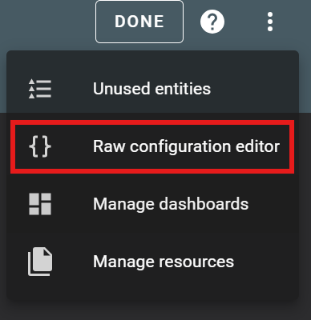

For now it's just one Dashboard that I'm sharing, maybe in the future there will be more (who knows).

## Living Room Dashboard v2025

Not sure if the dashboard has an official name. Just to be clear, I didn't design it myself. I downloaded it from a HA community group where it was shared by a Danish HA enthousiast. 

To use the dashboard, you just need to create a new HA dashboard by going to __Settings__ > __Dashboards__ > __Add Dashboard__ (or follow [these](https://www.home-assistant.io/dashboards/dashboards/#creating-a-new-dashboard) instructions).

, open it and press the Edit button on the top right, followed by pressing on the three dots on the top right and press __RAW Configuration Editor__. Select all the text and replace it with the yaml code from the dashboard.

 

This panel does come with a number of custom cards and integrations (for some of which you will need to install [HACS](https://hacs.xyz/)). The installation/configuration of those integrations and custom cards is not something I'm going to cover. I'll try to list all of them (at some later stage) on this page, so you know what cards and integrations you could/should install when using this dashboard.

###Download the Dashboard
- [Wo-25.yaml](/dashboards/yaml/wo25.yaml) - this contains the code you need to copy in the empty dashboard
- [images](/dashboards/images/) - download the __wo-25__ folder with all images and place that folder in the __config/www__ folder in your Home Assistant instance.